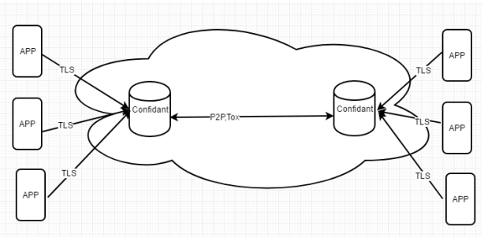

# Confidant

---

---

"私信通"项目节点后台代码

提供分布式隐私通信服务

配合APP使用，用户通过TLS加密连接⾄安全路由器，安全路由器通过完全去中⼼化的p2p⽹络连接⾄对端的安全路由器，对端路由器再通过tls连接对端app。信息流在整个传输过程中都是加密的，并且没有任何中⼼化节点，从⽽构架起⼀个完全去中⼼化的私⼈安全⽹络通信通道

数据安全。所有用户数据（包括用户个人信息数据，用户聊天数据，用户分享文件数据），加密保存在节点端，客户手机app端相应数据，保证用户数据的安全性。

本项目目前支持linux系统下的X86设备和嵌入式设备（如树莓派，onespace等）

---

## Key Features

- 用户注册，登陆
- 用户添加好友，加密聊天，分享文件，随时撤回聊天信息
- 用户群组聊天，分享文件

## Dependencies

* 目标系统为linux系统，暂不支持mac和windows
* 依赖库包括
  * websockets
  * sqlite3
  * sodium
  * qrencode
  * libpng
## Build and Run
### 	获取master版本

​		git clone https://github.com/confidantstation/Confidant-Station.git
​		cd Confidant-Station

### 	目录说明

​	     Confidant-Station

​		----doc          项目API接口文档目录

​		----files	 项目配套资源文件目录

​		----pack.sh   Onespace设备上打包脚本

​		----ppr          升级脚本目录

​		----source     项目代码源目录

### 	编译

- X86

  cp Makefile_x86 Makefile

  make

- Onespace

  依赖交叉编译环境

  cp Makefile_onespace Makefile

  make

- openwrt

  Confidant集成到openwrt/package

  cp Makefile_openwrt Makefile

  make package/Confidant/{clean,compile} V=s

#### Debug Log
第一次运行起来需要

mkdir /tmp/logdisk

然后可以通过

tail -f /tmp/logdisk/pnrouter_debug.log 

查看相应日志

## Contributions

Confidant项目配套使用项目，有相关问题可以邮件与开发者联系

## Links & Resources
* 
